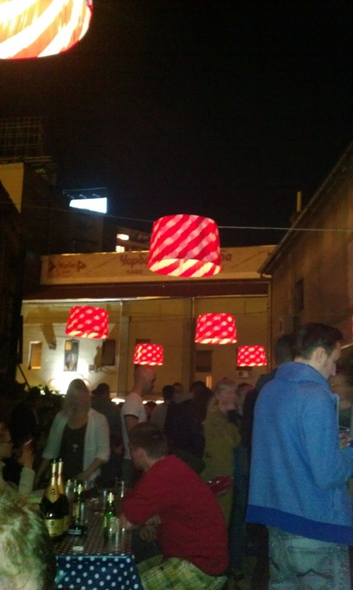
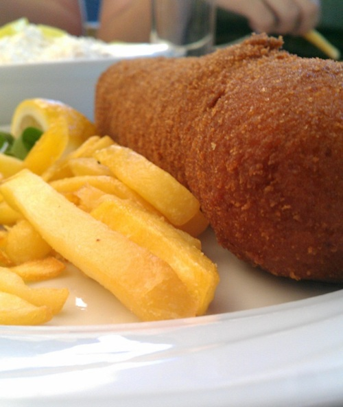
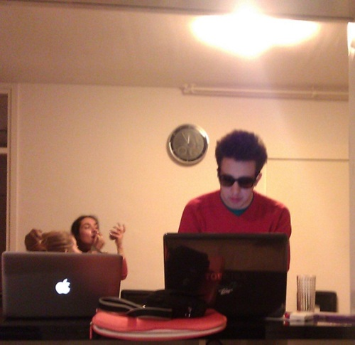
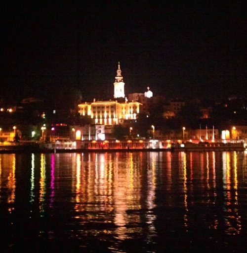
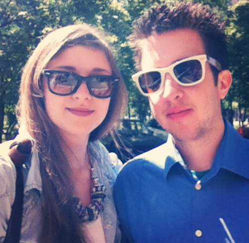

So, it’s been a while. Again. Since then, I’ve closed a successful project, opened a new one and in the meantime studied for college, started writing for [Netokracija](http://www.netokracija.com/) and **visited Belgrade** for the [Share Conference](http://www.shareconference.net/). 

I won’t be writing about projects or studying, this post will be about attending the **Share Conference** in Belgrade, impressions about the whole trip, people I met and shared (see what I did there :P ) a weekend with.

So, a couple of weeks ago Ivan, editor of Netokracija, asked me if I wanted to come with''em to the Share Conference. I knew that the Share conference is a three day conference and one of the **biggest conferences** in the region and I have been thinking about attending it by myself, on my own but as it’s rather far and since I had no company, I settled with not going. So, when asked, without even thinking about it - I said yes! 

Weeks went by and our departure came closer and closer and so the excitement grew. Before the trip, I prepared myself, circled the lectures I wanted to see, Googled the lecturers that seemed interesting. On the departure day, the plan was that Ivan and Marina would pick me up at 17 o''clock with a van that was driven by a Serbian guy going to Belgrade. Haha, funny thing - the guy wasn’t familiar with Zagreb at all so, as he had to collect about a half a dozen people, they picked me at about 18,30 cca … During that time, I contacted Ivan about 2,3 times and he kept assuring me that they were coming. Since April Fools’ day passed, I wasn’t sure if he’s trolling me or not. Eventually, they picked me up and we set off. 

I haven’t been to Belgrade before so I was rather surprised to see whole lotta people on the streets at 23h as we entered the city. The city was vivid and fast food stands were full. My first impression was **“WOW! Belgrade is huge!”**. I wasn’t wrong. 

We came to the apartment and then I met the rest of the team. Tihana @taroofie, a huge jazz fan that doesn’t like metal, Ivana [@ivanavie](https://twitter.com/ivanavie), a lovely girl in love with a Texan, Nikola [@nikolaplejic](https://twitter.com/nikolaplejic), the developer (nothing more to add there :) ). I already knew Marina [@marinshe](https://twitter.com/marinshe), a passionate art photographer and Ivan [@ivanbrezakbrkan](https://twitter.com/ivanbrezakbrkan), editor of Netokracija. As we came in, they already had the drinks ready. Apparently, we ruined their plan of going out, so they brought the party home. It worked out great for me. :D

The apartment was situated in the New Belgrade area with a nice view from the balcony. I can’t specify what we were actually looking at, but I know we saw a big Pet Shop and a railway. All in all, the apartment was really nice and cosy. Tihana would beg to differ since she thought I slept on the floor when in fact I slept on a double inflatable bed (one of those that people use in summer on the beach, just really, really nicer). 

So, the next day, we went to the Conference. Even though the Conference started at noon, we came at about 13, 14h, got in, got our wristbands and listened to a couple of lectures. At this point, I have to emphasize something. As I prepared for the Conference, everyone that attended it last year told me that Share was like no other conference. That it was different by far. Boy, were they right. 

The first lecture I attended was by **Aubrey de Grey** from the Sense foundation. He’s a guy, about 150 years old with a beard half a meter long, who claimed that a person who’ll live up to 150 years has already been born. Dafuq did I just hear?! The next lecture was from Elisabeth Stark, a lecturer from Stanford who was influential in stopping SOPA. I don’t want to be a player-hater, but I thought it was going to be a great lecture, her sharing some inside information and stuff. Maybe she had a bad day, I honestly don’t know, but the lecture was poor. It was a retrospective of a whole fight. As simple as that. I haven’t heard a single new thing. And yes, she read from the slides the whole time. I was rather disappointed so … when disappointed, go for a drink and have something to eat. That’s what we did. On the exit, we ran into Barbara [@barbaraslade](https://twitter.com/barbaraslade) who was wearing her usual arty, unique dress. With her, you just never know what she will wear the next time you see her but you do know for sure that she will surprise the hell out of you! Had a nice little chat and hug and went on separated ways.

On our way to eat, we met Alen [@topssy](https://twitter.com/topssy) who recommended a Japanese-Chinese restaurant. Yes, yes, I know - Japanese-Chinese in Belgrade?! Yes, it was just around the corner, we here hungry and there was no time to lose. Even though I’ve seen Alen before on a number of occasions on #Tweetups, I''ve met him for the first time. With a rock ‘n’ roll clothing style and big earrings, I could’ve swore he was a lead singer in a successful band. I wasn’t that wrong - after leaving the cult Radio101 station in Zagreb, he created a first online radio station in Croatia Radio808. We ate, some adored the sushi, some were afraid of it (right Tihana?) but all in all - it was a great meal. 

Being full, we returned to the apartment. The party started, music repertoire was unlimited from YouTube, combined with [Pervan](https://www.youtube.com/watch?v=VEHwhYphRVU) and RWJ parodies. We truly had an awesome time. And then we went out to the Kulturni Centar. There, I met Nebojsa [@eniac](https://twitter.com/eniac), who was out host for the night. I have heard for him before (who hasn’t?!), I knew he was **the man** for digital and social media marketing in Serbia, but I was really impressed at how down-to-earth he was. Really polite, straightforward guy, doing his stuff he does best. Knowing how geeky we all were, when we got the Kulturni Centar, he put up a Internet hotspot from his phone. Needless to say, everyone check-in, Instagram pics were upload instantly. It’s hard to explain Kulturni Centar. It’s situated by the river and contains the main building (where the bar is - the bar was constantly full!) and the yard outside with tables and chairs. We were outside, talking and having a good time. Due to the constant crowd at the bar, alcohol didn’t affect us - there was no alcohol. We had a lesson learned for the next day. :D

{:class="img-responsive"}

As it was a long night, the morning came late as well. We skipped breakfast, met with Nebojsa and went straight to lunch to the Srpska kafana. Meat! Pljeskavica, filled vesalica, white vesalica, karadordev steak along with french fries and sopska salad. If you don’t know those, google it up ASAP! Eventually, a cup of Turkish coffee was served. Sun was shining and it was time to relax. At that time, I also met Vladimir [@vulicvladimir](https://twitter.com/vulicvladimir) who is the guy for the social media marketing and startups in Montenegro. Or so I was told. Decent chap.

{:class="img-responsive"}

After lunch, since we were at a conference, we went to listen to some lectures including a lecture from Vuk Cosic on NeoArt, a new form of art. The night was coming, so Tihana, Ivana, Nikola and me went for a walk through Belgrade. Since the elections were coming up, there was a big gathering of the Serbian National party (or whatever-dafuq they’re called). We realized that only moments before coming to the main square and were instructed to stay silent. For obvious reasons. Seeing people, even children, old and young, male and female walk in front of me and being instructed to stay silent, I felt like Frodo walking through Mordor. I can understand that there was a war and everything, but hey! it was 15 years ago - snap out of it already!

Anyway, all went well, we went for a walk through the city, got back to the apartment and another party night could begin. YouTube music on max, we were ready. Unlike the night before and the one-hour-long waiting in front of the bar, this time we were prepared - we took a putna (sorry English speaking people, I won’t translate this one) with us. No time to lose now. Marina, Ivana and Ivan were tired, so Tihana, Nikola and I went alone to the Tube. The dance floor awaited, music was great and dancing started!

{:class="img-responsive"}

There, @AhFrida (dammit, I don’t know her real name) awaited us. Now, as I was told before - @AhFrida is a sort of a female Twitter legend from Serbia. Everyone knows about her, but not much of them have actually seen her. Even less of them have actually met her. Well, guess what - I’ve met her. And have even talked to her! She even shook my hand. It was the moment of the whole weekend. :D

{:class="img-responsive"}

Visiting Belgrade just wouldn’t be the same without visiting the rafts (splavovi). Like an after-party thing, at 3 in the morning - the 20/44 raft was ours. Music at the loudest, we stayed by the fence and talked and run the evening to a close. The next morning, we caught a train home and 8 hours later arrived back in Zagreb. 

Conclusion: The intention of this blog post was not to comment (too much) on the (quality of) lectures, it was to share my impressions as a first timer on such an event. Even though the atmosphere was pretty much hipster-like (everyone had those Ray Ban glasses, myself included (look at the pictures!)) with quite a dose of a young alternative rebellious look that echoed “*uck the system”, everyone was having their Macbooks and iPhones ready to trigger those pictures and have the status updates delivered to Facebook/Twitter in real time.

{:class="img-responsive"}

Networking was awesome, I met a tone of people with whom I tend to stay in (virtual) touch. I’m sorry if I missed to mention some people above. Food and party atmosphere was damn awesome, the extent of waiter courtesy is just unbelievable and the food is too delicious at a very, very good price! To conclude, even though I have to admit that the lectures were not my particular cup of tea, I cannot say that I won’t be coming next year to Share. As I was warned before, Share is different than anything else! ;-)

PS - A kind advise: **don’t ever use the train Belgrade-Zagreb**, it’s not worth it. 8 hour ride now, what used to be a 4 hour ride 30 years ago. It says it all.

--

[Original post on Tumblr](http://msrsan.tumblr.com/post/22269124286/share-2012)
