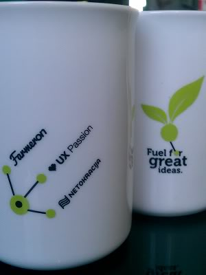

As I mentioned from my last post where I welcomed Dave McClure and the whole #GOAP crew to Croatia, **startup atmosphere in Croatia is hot.** 

To prove my point, I’ll point out one event that, in my opinion, has contributed most and has given a biggest push to the startup community. Don’t get me wrong, “Startup Wednesdays”, “Mobile Mondays”, “CISEx Fridays”, the student competitions and all the other ones that were organised are great and have effected and created the community from the scratch, bringing it together, being that creative spark. We had a lot of lectures, met a bunch of important people, had [Credo Ventures for a talk](http://www.netokracija.com/credo-ventures-zagreb-upoznalo-80-netokrata-netokracija-startup-srijeda-16382) and even the guys from the USA Embassy who gave their [support](http://www.netokracija.com/push-to-the-startup-world-in-croatia-27100). 

But, nothing can top Seedcamp. [Seedcamp](http://seedcamp.com/) is the biggest european micro Seed Fund for internet technology companies based in London and founded only 5 years ago. It organizes its events around the globe, helping startups in their initial phase with advice, providing network of mentors and, eventually, even with the investment. Seedcamp visited Croatia last week for the second time and have put Zagreb on the startup map of Europe next to London, Berlin, Tel Aviv, Tallinn, Lisbon and Paris. Apart from the direct benefit Seedcamp gives to the teams that get invited (I’ll get to that later), Seedcamp brings along about 40, 50 foreign mentors that mix with about 30, 40 local mentors like Ivan Brezan Brkan from Netokracija, Matija Kopic from Farmeron, Vibor Cipan from UX Passion, Sasa Cvetojevic and Mihovil Barancic from CRANE or Ivo Spigel from Perpetuum Mobile. In that mix, foreign mentors get to know the background of the country, a little about their mentality, the opportunities for the startups and they generally network. That creates contact and opportunities for further visits and even for doing business together. I’ve seen it, it’s not just a cliche. 

{:class="img-responsive"}

The [process](http://seedcamp.com/looking-for-funding/) of attending Seedcamp is pretty easy, the team applies and then 20 teams get selected and invited based on a various criteria. During the event, each team has their 3 minute pitch in front of the numerous investors, mentors, sponsors and partners followed by the the 40,50 minute opportunity of talking to some of them individually, sharing their problems and seeking advice and suggestions. Since mentors all have very diversified backgrounds, every team will have all their questions answered regardless of their nature (finance, marketing, technical or other).

Till now, I haven’t had a chance to participate in such an event. I was really impressed with the teams and their ability to pitch. Bum, bum, bum, bum, bum, like on a track, one team pitched after the other, 3 minutes, bum, there comes another one. Disciplined, with no delay, perfect. Of course, there were differences between teams and pitches. Some of them came more than ready, having known what exactly were they going to say in those 3 minutes while others were not that well prepared, stuttering, having their PPT presentations done poorly. I noticed one other thing. I understand that most teams have at least two co-founders and that both of them came to the Seedcamp event to pitch. And that’s ok, but I don’t understand the point of having both co-founders “pitch”, both co-founders on stage when in fact only one of them is pitching. Is it a visual thing, does the other co-founder (the one not pitching) give his support in that way, does he just want to be visible, will the pitcher actually do better if he has his compadre standing next to him. Maybe. I don’t know but that’s one thing I found most interesting to see.

Apart from that, I was fairly surprised about the approach teams had. Common belief about Seedcamp and fund events is that teams come there simply and only to raise money, to get an investment. That’s what I thought. But, and I can’t say for the other events, but on Seedcamp, teams come not just for the sole purpose of raising money. Some teams even state that during their pitch. Since during the Seedcamp event teams can talk to mentors and gather advice, that is what they’ve come to get. Advice, contacts, suggestions, business and payment model help. That fact brings the whole thing to a **totally different level**. 

You can find the teams that came to Zagreb [here](http://seedcamp.com/2012/06/seedcamp-zagreb-meet-the-teams.html). I will just highlight some of them I find interesting. [6sync](http://6sync.com/), a team of two who are developing a hosting management platform whose goal is to cut down the hosting costs. [Mash.me](http://www.mash.me/), a Kinect web application for video recording with real time motion capturing and effects had a nice, structured and down to earth pitch. [Table&Friends](http://www.tableandfriends.com/), a group dinner reservation system. Anctu, a social search engine with detailed analysis. [Publification](http://publification.com/), a cloud-based ebook in browser reader had an awesome, most energetic pitch. Their pitch was different from all others by far and I’m sure it will be remembered. Last but not least, [Shoe Addicts](http://shoeaddicts.me/), a lovely photo sharing app for the shoe lovers.

Like I said, I haven’t participated in such an event before so I would really like to thank **Carlos** and **Kirsten** from Seedcamp on an opportunity they’ve given me to help organize the event. The whole event was absolutely unbelievable with the informal part at the end that rocked! I am sure everyone who was there will agree!

PS - This song brings me a whole other set of associations now. Along with Austin Powers. :)  



--

[Original post on Tumblr](http://msrsan.tumblr.com/post/25356457464/seedcamp-zagreb-2012)
