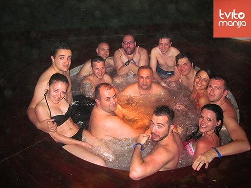
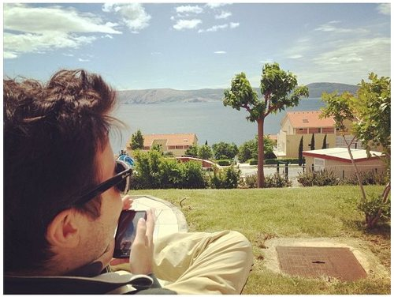

So, almost a week has passed since [Tvitomanija](http://www.tvitomanija.me/) ended and nostalgia can still be found in the [#tvitomanija](https://twitter.com/search?f=tweets&q=tvitomanija&src=typd) hashtags on Twitter. Both Tvitostalgia and hate. Well, haters are everywhere so I won’t be mentioning them. At least not that often. Let’s see what actually happened.

Tvitomanija, a truly regional social media conference, took place at Novi Vinodolski, a small place near the coast in Croatia in a Novi Spa resort. Novi Spa resort is a big, big, huuge resort packed with well equipped apartments and hotel rooms, spreading over a couple of square kilometers, so vast one has to be driven to their apartment in a “golf kart”. Even though I haven’t seen the actual star number the resort has, my guess would be between 4 and 5. And, as a venue for a conference, that means a lot of opportunities for the participants. 

When I say “truly regional”, I really mean it. There were over 600 attendees, mostly from Serbia but also from Croatia, Montenegro and Slovenia. One might argue that getting 500 people to an event that is approximately 600 kilometers away is easy - I would say that it is terribly hard. A lot of hustling and marketing, tweets and TweetUPs, getting everyone’s attention and matching your supply with their demand. Surely one of the factors for getting so many attendees was a really acceptable accommodation and conference price. Hopefully, that won’t change (drastically) in the years to come. 

Conference schedule (lectures and panels) was intended so that everybody would benefit - professionals and beginners, amateurs and agencies, bloggers and individuals who use social media for themselves. We heard a couple of great “fights” - print VS social media, TV VS social media, we also heard lectures about entrepreneurship and influence on social media. Even though there were some great case studies (in example from [Farmeron’s](http://www.farmeron.com/) social media guy) - I hope to hear even more in the years to come. Tackling real problems, being creative and different and spreading your story around is something I look forward to. Anyone can “do social media” - push posts online, organize contests and follow strict FB guidelines, paste memes and bit*h about Mondays while welcoming Weekdays. There are a dozen people/agencies that don’t do (just) that - I want to hear them. I want to hear how they conquered new markets, focused on the demographics no one focused before, new niches and succeeded/failed. Just sayin’.

The “formal” part was great, the “informal” was even better. Great food, great weather (except for some rain - we got over it quickly), awesome feeling when waking up to see the sea from your doorsteps, cold pools and hot saunas with a must try jacuzzi that was always crowded. Having known [Torbica](https://twitter.com/torbica), zhurkas or parties were something I particularly looked forward to. They were mostly great, but, in my opinion, the last one was the best! 

{:class="img-responsive"}

Also, people were awesome as well - getting to match Twitter profile pictures with real faces is always a good feeling. The energy and positive attitudes that spread around Novi Vinodolski during those days were something the organizers could really be proud of - Torbica, [Mina](https://twitter.com/Mina_fu) and [Ivana](https://twitter.com/IDrecun) have done a remarkable job joining and matching us all together in such a nice place, giving us the opportunity to learn from each other while having the “social media time of our lives”. Well done once again and see you next year! :)

{:class="img-responsive"}

PS - Obviously, Netokracija was there - Ivan, Marina, Mia, Ivy, Marko and myself were constantly present and have covered the conference from the start to the end in both english and non-english. Check it out! :)

PPS - Regarding the haters, I have to say I do not understand them. I can understand being jealous about not coming to Tvitomanija, I can understand just trolling and wanting to get attention. Apart from just not being able to filter-out the tweets concerning Tvitomanija, I’d say the haters have some serious issues and I look forward to posting both pictures and tweets about the great time we had at Tvitomanija. Let the hatin’ begin! :D  

--

[Original post on Tumblr](http://msrsan.tumblr.com/post/50642971691/tvitomanija)
