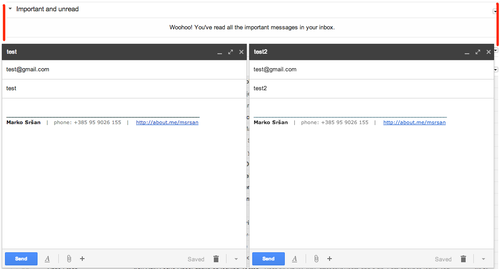
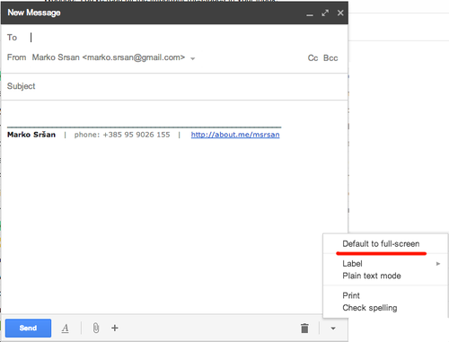
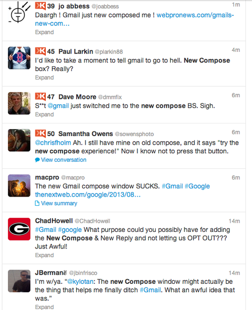

Remember late last year when, trying to compose a new mail from your gmail account, you were pi**ed off by the **New Compose** option Google made you click? Remember how you searched (Googled) to find an alternative just so you wouldn’t be forced to have a pop-up window every time you wanted to send a mail? Eventually, you found the way - “temporarily switch back to old compose” did the trick.

You were happy, couple of months passed and in March there was another “try” into making you use the new compose. Even though experienced, you were slightly scared that the learned trick won’t work this time. But, it did and you got yourself out of the pickle once more. One thing I am sure you asked yourself was - how long will this “temporarily” actually last? Well .. due to the official [Google statement](https://plus.google.com/u/0/+Gmail/posts/Pkrnsy8yEPx), I’m sorry to inform you it has just stopped.

That was me. And that was you. Don’t deny. Even though a whole bunch of people I know, both UX designers that actually know this kind of stuff and regular common people that have no idea, had quite a lot of things to say about the new compose in their inboxes, none of those things were positive. “How to change?”, “What to do?”, “What are my options?”, “Will it stay?”. Now, it will.

Now, every time you want to write a mail, a pop-up window on the lower right corner will come out. While in the middle of writing your mail you want another mail, no problem - another pop-up window is right next to the one already open. So, now you can multitask - write one, write another. And then, you receive a mail, you can instantly see who is it from, do you have to answer it right away (of course you do!) - so, now you have **3 pop-up windows at the lower right corner of your screen. Multitask away!**

{:class="img-responsive"}

To make things even worse - on smaller screens, you couldn’t multitask even if you want to (the red lines above mark the inbox width).

Yes, I am a bit sarcastic here and you can imagine why - I really don’t like to new compose in my gmail account. I think it’s bad and, even though it’s an noble idea to try to improve my productivity by allowing me to see the received messages (and to browse through the rest of the inbox) while writing a new message, I really don’t need it and I don’t want it. I don’t want to move my head up-down while I’m at a 30’ screen. I don’t want to move my mouse all the way to the lower-right to tick a CC button just so I could add a contact in. Not to mention the attachments (all sorts of those), partly visible and dynamic “+” or the “let me get out of your way” FROM field in the compose window. **Thanks, but no thanks.**

So, what am I going to do now? Close the account and quit gmail? Well, unfortunately no. Thankfully, there’s a little lifesaver (or gmail-saver?), and no, there’s no “temporarily” option now - you can choose a *Default to full-screen”* option. That options allows you to get a centered compose window every time you want to write a new mail. It’s definitely better than the alternative.

{:class="img-responsive"}

To sum up - the new compose is the worst UX step Google has taken so far. Even though I know that I cannot do much about it, due to the numerous complaints and criticism (just check the Twitter [feed](https://twitter.com/search?f=tweets&q=%22new%20compose%22&src=typd), try the [Quora posts](https://www.quora.com/search?q=gmail+new+compose) where mostly smart people post), it is really weird and unimaginable that they pushed it through.

PS - This is definitely not the “Bring the old Facebook back” kind of post. I do welcome change. But good change. I am an everyday gmail user, it’s definitely a part of my life, both professional and personal one, but I simply don’t see any value whatsoever in this change except for running more miles on my mouse and getting more exercise for my neck (up <=> down-right).

PS II - Million dollar question - How can I “Discard” a message from a new compose window? I can minimize it, I can send it, I “can” add an attachment (if I really try), but how can I discard/cancel it? If After already filling in TO and SUBJECT fields, I suddenly change my mind and don’t want to send the email at all (I want to discard it, cancel it, trash it) and the “X” at the up-right of the compose window will not discard it - it will still be saved in my drafts. 

EDIT - Found it! It was in the “trash can” (where usually a delete option is).

{:class="img-responsive"}

--

[Original post on Tumblr](http://msrsan.tumblr.com/post/58186972563/new-compose-gmail-is-here-to-stay)
