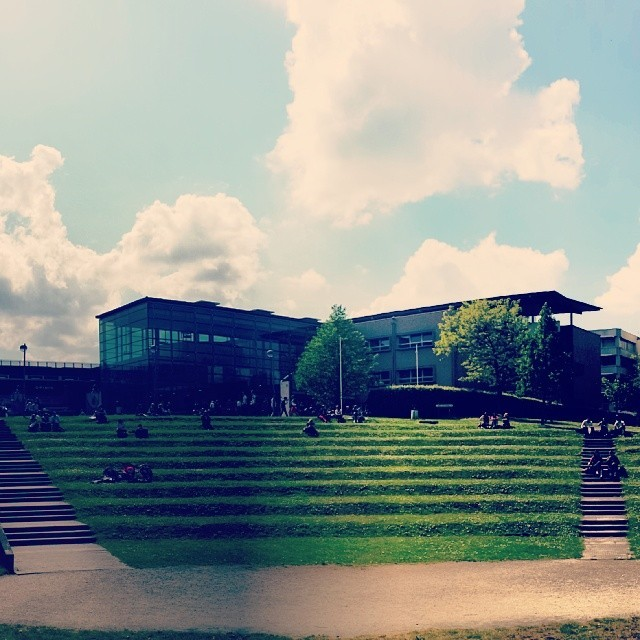

It’s been exactly four weeks since I arrived to Brussels for my summer Erasmus semester. As most have pointed out, the biggest challenge would be to find accommodation. Especially if you’re looking for a 4 bedroom place (possibly a house) that has to be furnished, for a period of 5 months and for a price of up to 500 euros per month per person. After a month of thorough search via Facebook accommodation groups and other online channels, couple of friends went to check the selected accommodation onsite.

All of them were actually ok, apart from the one that “had to be finished” (the whole place was in the process of redecoration and renovation), but I decided on the **4 bedroom place in Watermael Boisfort**. Even though the place is awesome, it’s actually hard to explain what is it. I’ll try - it’s a giant, huge house that is partly a student residence place and partly a bed ’n’ breakfast type of accommodation. So, it has 4 student rooms + common area for the students (nice living room, fully equipped kitchen and bathroom) and on the other side, it has a number of fully equipped rooms that are in use by the “passing guests” who are staying short-term. So far, I encountered a few “passing guest” in the corridors.  

Even though I’ll come back to the “accommodation” part in one of the following blog posts, I do have to say that so far it’s been an **awesome experience** living with roommates (personally, I haven’t done that before). I’m living with a Danish girl, a Spanish guy and a Croatian girl. As far as I can tell, the Danish girl and the Spanish guy appreciate that there’s basically no Croatian spoken in the house - we’ll try to keep it that way. Apart from the Spanish guy who is doing his internship in Brussels, us three are all on the Erasmus semester at **ICHEC** (Brussels management school) and even have classes together. Studies have not yet taken place that much (apart from some presentation work), but partying, meeting new people from class, sightseeing and traveling around has. The early shyness and icebreakers had passed and students got to know each other better over the last weeks, so the best is yet to come surely. 

But, the aim of this blog post is to point out my Top 3 impressions, things that I feel are different (better or worse) than in Croatia. Those are the things that couldn’t stayed unmentioned and that will definitely stay in my head as the instant associations of Brussels and have been encountered in this first month. Maybe, maaaaybe, my view on some of them will change over time. 

1. Transport system, driving and the attitude

    There are a lot of stereotypes about driving all over the world. Italians drive awful, they curse and scream. They are always in a hurry, wanting to get to the destination as fast as they can, ruthlessly cutting lines and changing tracks without their turn signal. Yes, that’s what most of the world says about Italians. It’s actually been a while since I’ve been to Italy, so maybe things have changed, but in Belgium - everything is completely opposite of that italian stereotype. 
    
    Even though I have to admit seeing quite a lot of improperly parked cars (most of them have their one or both left/right wheels parked on the pavement), people drive way too calmly for my taste. And that says a lot. Everyone is too polite, everyone is too slow, everyone waits for everyone else no matter where that someone is - 1, 10 or 30 meters away.  
    
    To be quite frank, I drive in Croatia all the time, so now in Belgium I feel as if I’ve been brought back to high school - taking the bus, metro and other means of transport. And, I can see the differences. Here, bus drivers actually wait for a passenger who is approaching the bus no mater what. It doesn’t matter if the passenger is walking, running or crawling to get in the bus. It doesn’t even matter if a passenger has missed the bus (the bus went on for 20,30 meters passed that actual bus station) if the driver saw the passenger in the rear view mirror. He’ll stop. In the middle of the road, open the door and you’ll get in. He’ll even greet you - “Bon jour, monsieur!”. 
    
    I’m still shocked. And then you think - “well, that’s the way only bus drivers behave, they have to be polite and nice”. But no. Everyone behaves that way - in the night as well. On Saturday. You’re going out, crossing the road at 10 pm and the guy in a black BMW stops at the crossing for you. I assure you that would happen in Zagreb. No way. You’d be coursed and honked at, maybe the guy from the BMW would even get out of his car to argue with you about your will to cross the damn road.

2. Wind 

    Now, to be perfectly honest - Brussels wasn’t my top priority as a destination where I’d do my exchange semester. Lisbon was my top choice. Apart from the good University, Lisbon’s weather is awesome. But, someone decided I needed to experience the weather in Belgium, so here I am. From the first day, I have been warned that the weather in Belgium is kind of like the weather of UK - if I see Sun, that’s because I’m watching the TV; if I feel warm, that’s because my heating is turned on. The warnings weren’t wrong - the weather during this month was really something like that. Rainy, cold, rainy and cold. But, since there were actually, a couple of nice days - I’ll give weather another chance. 
    
    But, the thing that has been a constant during all, and I mean literally all, days was the wind. It was like a shadow, wherever you go, whenever you go - it’s there. Light breeze or full throttle, cold as ice or subtle blow just to keep you reminded that it’s there - you name it. Day or night, breakfast or dinner, it really doesn’t matter. It blows all the time.  
    
    Since the wind doesn’t blow all the time in Croatia, I’ve noticed it quite early and every time I go out. Just to be clear, I don’t mind when wind is blowing real hard. When it’s blowing, it’s blowing. And that’s alright. It has to do that. But, when it’s blowing just because it can, just to make itself present, not hard, but really week, but enough to make it annoying - that’s what I have problem with. Hopefully, it’ll stop any time soon.
    
    {:class="img-responsive"}

3. Student food

    Student life is nice, everyone knows that and everyone wants to go back to their student years and student obligations. During those years, one could sleep for 4 hours, go to class, party hard, sleep for 4 hours again, eat crap during the day and then part some more. I’m not saying that I do that ( :D ), but I do like to eat good. I can’t live on fast food and regular pasta for a week.  
    
    So, since ICHEC doesn’t have a restaurant, I received a suggestion to go and take a look at the VUB restaurant (I think, VUB is the largest university in Brussels - I might not be right). I was really surprised. The restaurant is organised by the type of food you want to eat - healthy (that’s almost always empty, no interest for healthy food in the student population), vegetarian (some interest), wok (lots and lots of students like that), regular menu and pasta. The menu of the whole restaurant is [online](https://intranet.vub.ac.be/restaurant/menuetterbeekENG.html) and known for the whole upcoming week so you can plan well ahead.

    But, that’s theory. In practice, for *5 euros* you get a whole menu (a soup, main meal, side dish, salad, desert) from whichever “type” of food you like. To give an example, you can get a tomato soup, spare ribs (2 times 5 ribs) with a spicy sauce and a Mexican salad along with either rice or french fries and a dessert (pudding, fruit, whatever). For 5 euros. And no - it doesn’t taste like 5 euro food - it fast extraordinary. Awesome. Great. Tasty and delicious. Just look at the pictures. There are some nice student restaurants in Croatia, but nothing like this. I’m gonna definitely be spending my lunches there :D  
    
    {:class="img-responsive"}

Well .. that’s it for now. Those are the things that were noticed almost immediately during this last month. So, use Belgium transport regularly, don’t be scared you’ll be hit by a car (you won’t), mind the wind and eat in the VUB student restaurant! :D

--

[Original post on Tumblr](http://msrsan.tumblr.com/post/78096313746/top-3-impressions-brussels)
