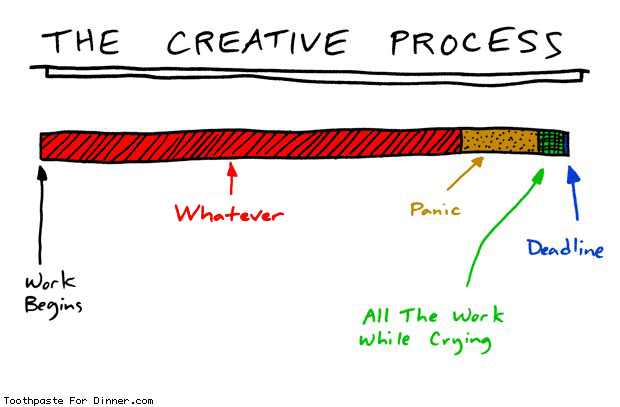

What I learned and experienced as an Associate...

A LOT of stuff happened since since the Techstars London Winter ’14 batch and since my [Associate role](https://medium.com/@msrsan/how-i-got-accepted-to-techstars-london-40f27b325e29) ended and I never got to finish and publish this blog post. I was even asked to do a talk on the subject for the [Startup Addventure](http://2015.startupaddventure.co/) in Zagreb, you can see the [slides here](http://www.slideshare.net/europeventuresummit/sa-zagreb-marko-srsan?qid=217a0c01-5f5b-4ddc-9b99-80441ee26deb&v=default&b=&from_search=59).

The list of lessons was put together by observing the environment, founders and their actions during the programme, comparing it to my prior-environment (Croatia) and my previous experiences, in both work and personal sense. The goal is to show my personal experience from Techstars, both in regards to cultural and business differences.

So, here is the 6 LLs. Why 6? Because I always like to go one step further :D

---

TL;DR

1. Function over form
2. Treat every situation as a new learning opportunity
3. Put yourself in another person’s shoes
4. Make a decision
5. Proper deadlines bring the best in you
6. Keep it brief, short and simple

--

**FULL VERSION**

**Function over form**

For me, this was the biggest cultural difference. My experience so far, based mostly on the work and legal environment of Croatia, was that there’s always a strong emphasis and imperative on the form.

Individuals are judged by what they wear and how they behave rather than how much value they bring. The same goes for the companies as well — in Croatia, everything is regulated: is your work desk the proper hight, is the temperature in the room just right, do you have a proper emergency exit, do you work long hours (if so, you will be fined because the state doesn’t allow that (?!)), did you take a proper vacation (who cares? Croatian government does, so you need to take a vacation or you’ll be fined (?!)) etc, etc.

For most of the things above, people in the UK simply don’t care. As life goes so fast, there’s no time to care, so the basic premise is: as long as you are not doing anything illegal, it doesn’t matter. What matters is is the job done, how can you make it more efficient and is the value there. If it isn’t, people will find someone else. If it is, then you’re doing a good job.

**Treat every situation as a new learning opportunity**

{:class="img-responsive"}

In a tornado of meetings and requests for meetings a regular person gets, it is sometimes hard to be humble and take them all. Sometimes you need to talk to people you don’t want to talk to because your job demands you to; sometimes your boss makes you do it; sometimes it’s just for the greater good.

It can be hard, hence you need to treat every situation as a new learning opportunity. Person opposite of you might help you in a way you cannot comprehend beforehand. Do you really want to miss that because “you didn’t feel like it”?

I’ve seen some pretty incredible outcomes of random meetings people took — from simple help, to actual deals and intros happening that made a HUGE difference to the company and the people that took them.

**Put yourself in another person’s shoes**

{:class="img-responsive"}

My experience so far tells me that hiring is one of the most critical steps in entrepreneurship. Even though person’s skills, knowledge and experience can be easily assessed (or can they?), finding the person that will “click” with you and your company values and culture is difficult.

So, during the interview process (and in general as well), put yourself in another person’s shoes. Ask them what they’d like to get out of it, what are their interests, why are they here, what would they like to learn and what drives them. Don’t assume, listen.

Find a balance and reach a compromise in terms of what you expect from a person and what that person actually wants and try to meet in the middle if possible. Don’t just push your story and expect it to be accepted just like that.

**Make a decision**

I don’t know why, but I am quite indecisive. It takes me some time to make a decision and I am prone to take my time and delay as much as possible. Possibly until the last last moment, regardless of decision size. It is good that I am aware of that and am working on it and getting better at it.

In a startup and business environment, this is quite important as the market and competitors are constantly moving (maybe even faster than you are). Without a decision made, you are sitting still and not moving, waiting for a miracle to happen.

At Techstars, Mentor Madness meetings happen in the first month and companies meet 80 mentors who help them with advice and suggestions. [Mentor whiplash](http://www.feld.com/archives/2013/07/the-positive-benefit-of-mentor-whiplash.html) happens along the way and companies need to decide which path will their company take and go and build/implement the decision in the second month. If they are indecisive, they lose time and momentum, they fall behind.

Even if you made a wrong decision, it doesn’t matter — you made it, you’l deal with it and will move on.

**Proper deadlines bring the best in you**

{:class="img-responsive"}

Projects are, among other things, defined by a deadline. Successful projects are those that are done before the deadline (even though that usually never happens as the deadline get pushed back once, twice or more times during the project).

In my mind, deadlines are a necessary evil. Without them, there’s no pressure, there’s no stress. You waste time, postpone it and have a “I will do it tomorrow” attitude. It usually never works unless you extremely disciplined.

With a deadline, with a proper deadline (Demo Day, date to hand in your Research paper, wedding (?)), people are always pushed over their limits. They excel and rise to the challenge, don’t sleep or sleep less, give 120% and succeed.

**Keep it brief, short and simple**

In my view, this is definitely a cultural thing mixed with pragmatism. What I learned is that Americans and English keep their emails short and tight, while the south-Europeans tend to write more. And it’s not strange as the coffee drinking culture is pretty famous in those countries.

I tend to write stories (as you can see from this blogpost :) ) in my emails and am almost never short and brief. I like to explain things, make sure all the questions are answered even though they might even not be asked yet. That changed and is changing and here’s where pragmatism kicks in.

{:class="img-responsive"}

As I got bombarded with email and as the quantity rose, my answers got shorter and shorter and I try to keep it to [five.sentenc.es](http://five.sentenc.es/) or even three. Sometimes it works.

The difference between short emails and the longer ones is that your email will be read or not, it will get you a meeting or not, it will land you a job or not. Nobody has time to read lengthy emails — they would rather jump on a call and deal straight with it directly.

--

PS — As I mentioned above, some things changed in the last few months. After finishing my Associate role, I worked briefly for a previous Techstars startup and then came back to a **Program Operator** role at Techstars London alongside [Max](https://twitter.com/maxkellyuk), [Jon](https://twitter.com/jd) and [Tak](https://twitter.com/tak_lo).

It’s been more than two months now and I’ve gone through a proper pre-program phase (from participating in a startup selection, to sourcing and hiring 10 associates and hackstars to managing and scheduling all the bits and pieces of the puzzle called Techstars London 2015).

Three weeks ago, the [program started](http://www.techstars.com/introducing-the-10-companies-for-the-london-fall-2015-class/), companies settled, met each other and went through the first Mentor Madness week. This time, compared to the associate role, the program is way different for me. There are a lot of moving parts, from sponsors and partners, to lecturers and mentors coming in and the hours are way longer. But, it’s exciting and great, very dynamic and I’m really happy as I’m learning a lot on a daily basis about relationship development, management and leadership on my own and from my mentor [Tak](http://www.taklo.co/), who’s done the [program 4 times now](http://taklo.co/its-my-fourth-london-techstars-program) and knows it inside out and probably with his eyes closed.

Fun times, stay tuned and definitely say ‘Hi’ if in London!

--

[Original post on Medium](https://medium.com/@msrsan/lessons-learned-from-the-techstars-london-winter-14-batch-61920acef616)