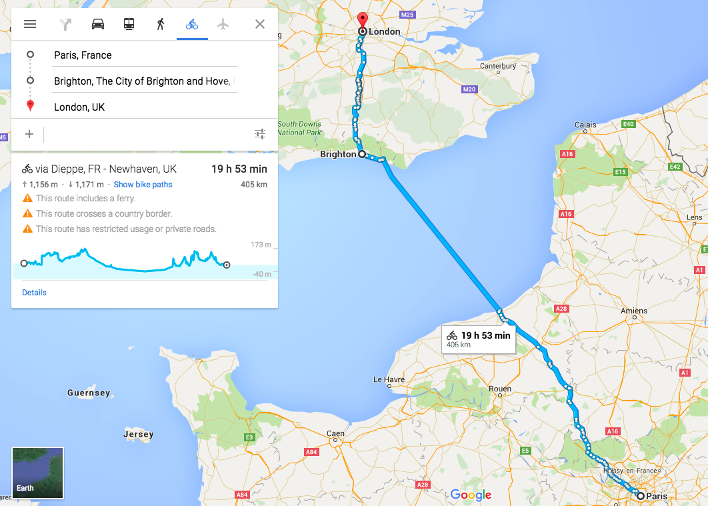

Facts:

- 250 million children in the world are not learning
- 800 million people in the world are illiterate
- 2/3 of that are women and children

Yes, appalling facts.

In my mind, my belief aligns with the quote from West Wing made by Sam Seaborn (even though it’s not necessarily oriented towards illiteracy but education in general):

*Education is the silver bullet. Education is everything. We don’t need little changes, we need gigantic, monumental changes. Schools should be palaces. The competition for the best teachers should be fierce. They should be making six-figure salaries. Schools should be incredibly expensive for government and absolutely free of charge to its citizens.*

You and me are probably here and reading this because we had a chance to go to school, to learn how to read, to learn how to write. That basic skill allowed us to progress to other fields — business, tech, medicine, law .. It allowed us to read books and experience the written word, the adventures and dramas and to express ourselves. **Consequently, it allowed us to be where we are today.** Some (roughly 10% of the world population) don’t have a chance to do that.

In order to help and turn the tide, [Techbikers](http://techbikers.com/), a group of enthusiasts involved mostly around tech and startups, are cycling from Paris to London in 10 days to raise awareness and fundraise for the cause. Two years ago they raised £52.000, last year they raised £65.000 and this year the aim is to raise even more.

Donations go directly to a non-profit organisation [RoomToRead](http://www.roomtoread.org/) that has **impacted the lives of over 6 million children** in the developing world since its inception in 2000. They constructed 1,450 schools, established 12,522 libraries, distributed 10,4 million children’s books and funded 13,662 long-term girls’ scholarships.

{:class="img-responsive"}

Even though I spent 2 weeks on average watching Tour de France in summers from 2001 to 2005 and have gone quite frequently cycling with a friend around my hometown back then, it would be a big overstatement if I said I was a cycling enthusiast. I haven’t cycled properly in years. But, ever since I heard about Techbikers couple of years back, I wanted to join: do something good for the cause which I believe in, have fun with fellow tech colleagues and do something cool (I think it’s pretty cool to ride from Paris to London).

--

So, 10 days from now, I will be cycling from Paris to London with 70 likeminded individuals. Apart from the pain and thrill I’ll go through, I will be raising £500 for the RoomToRead. Since everyone who read this had a chance for a good education, I would like to ask you to help me fundraise on the link below:

**[http://bit.ly/msrsan-for-RoomToRead](http://bit.ly/msrsan-for-RoomToRead)**

Thank you! :)

PS: There will be more updates over the next days, so make sure to follow my [Twitter](http://www.twitter.com/msrsan) and [Facebook account](http://www.facebook.com/msrsan). Thanks!

--

[Original post on Medium](https://medium.com/@msrsan/techbikers-2015-paris-london-turning-the-tide-on-illiteracy-18474d7c979b)