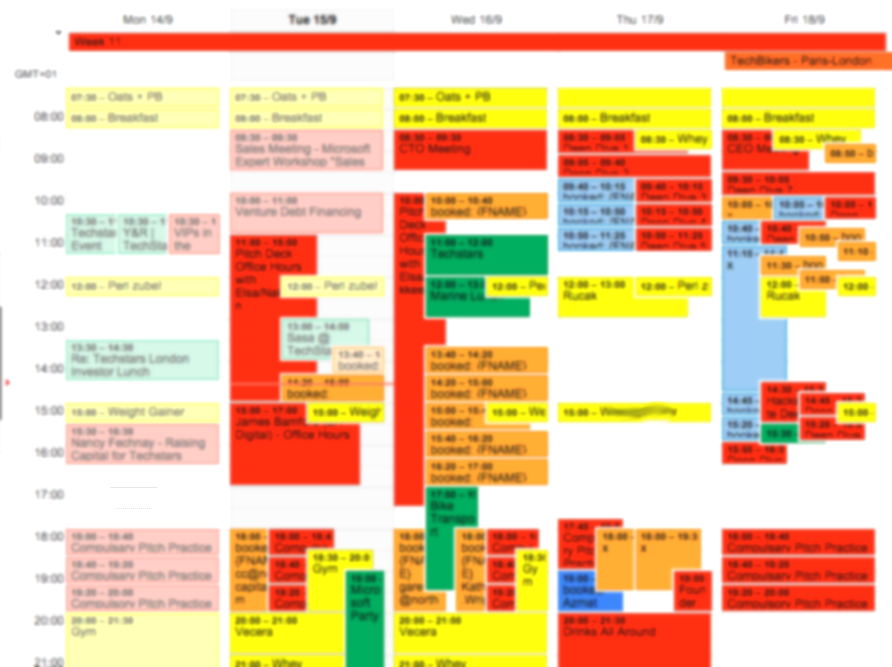
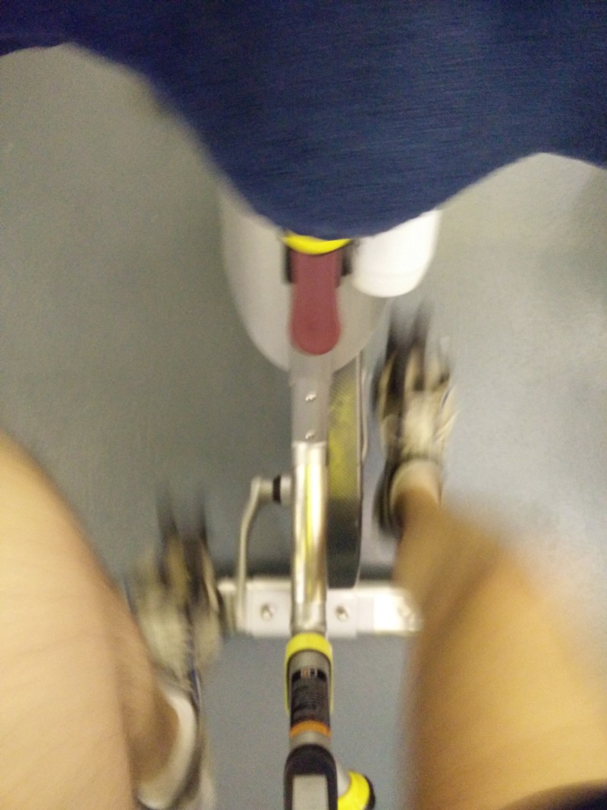

I wanted to [apply for TechBikers](https://medium.com/@msrsan/techbikers-2015-paris-london-turning-the-tide-on-illiteracy-18474d7c979b) for the last three years, there was simply no better time to decide to participate this year.

Even though my cycling history dates back to the 2000s and watching 3, 4 hours of Tour de France and Lance Armstrong (yes, I know!), I did have some good days in actual cycling back then. On a crazy mornings, my friend Borna and me would go and to 40–50–60 kms a day around town, around an artificial lake called Jarun in Zagreb. We bought the gear, the jersey, the padded shorts and gloves and even the bikes were treated properly and cleaned often. It was love.

After that, high school, university and other activities came to play, so I didn’t have much time to bike at all even though there was a plan to do Zagreb to Veli Losinj bike ride (280 km). Without a proper preparation and training, I wasn’t up for it and decided not to do it eventually.

But, even though Techstars is in program right now and I am working 10–14 hours a day, taking care of the companies and all the activities that happen, few months back I decided to participate in Techbikers and prepare for it as much as I can.

{:class="img-responsive"}

So, since British drive on the wrong side of the road, I joined the gym, started eating more and healthier. My daily gym pattern is 4 days and break; 4 days and break; 4 days and break. It was usually in the evening (around 8 PM, after work), but there were some times when I simply couldn’t make it afterwork so I did it in the morning at 6 AM. Also, since the whole Techstars calendar is pretty much planned out in advance, I always know when the free time for the gym will be and can basically round the gym schedule around Techstars perfectly. I never went to gym this persistently and with such discipline and it’s so awesome!

{:class="img-responsive"}

As I’m preparing for a bike ride, my gym sessions were mostly around doing legs and core — bike spinning, squats, lunges, various other machines (leg and calf press, leg curls and extensions etc.), planks, spiderman planks etc.. My gym days would usually start by rowing for 2k followed by either bike or machines or both. It would depend on the mood mostly — if I wanted to sit on a bike for an hour or if I wanted to do something more interesting.

Apart from feeling happier, I have seen the actual progress during this month and a half and that makes me happy — reducing times on the bike to reach certain distance and reducing times on the rowing machine for the 2k to actually being able to lift more and plank longer.

Whether I am ready or not for the Paris — London ride, we shall see, but I can pretty much say that I’ve done as much as I could considering the circumstances.

It’s gonna be a good ride :)

--

So, 4 days from now, I will be cycling from Paris to London with 70 likeminded individuals. Apart from the pain and thrill I’ll go through, I will be raising £500 for the RoomToRead. Since everyone who read this had a chance for a good education, I would like to ask you to help me fundraise on the link below:

**[http://bit.ly/msrsan-for-RoomToRead](http://bit.ly/msrsan-for-RoomToRead)**

Thank you! :)

PS: There will be more updates over the next days, so make sure to follow my [Twitter](http://www.twitter.com/msrsan) and [Facebook account](http://www.facebook.com/msrsan). Thanks!

--

[Original post on Medium](https://medium.com/@msrsan/techbikers-2015-paris-london-am-i-ready-e2b0c09fc14)