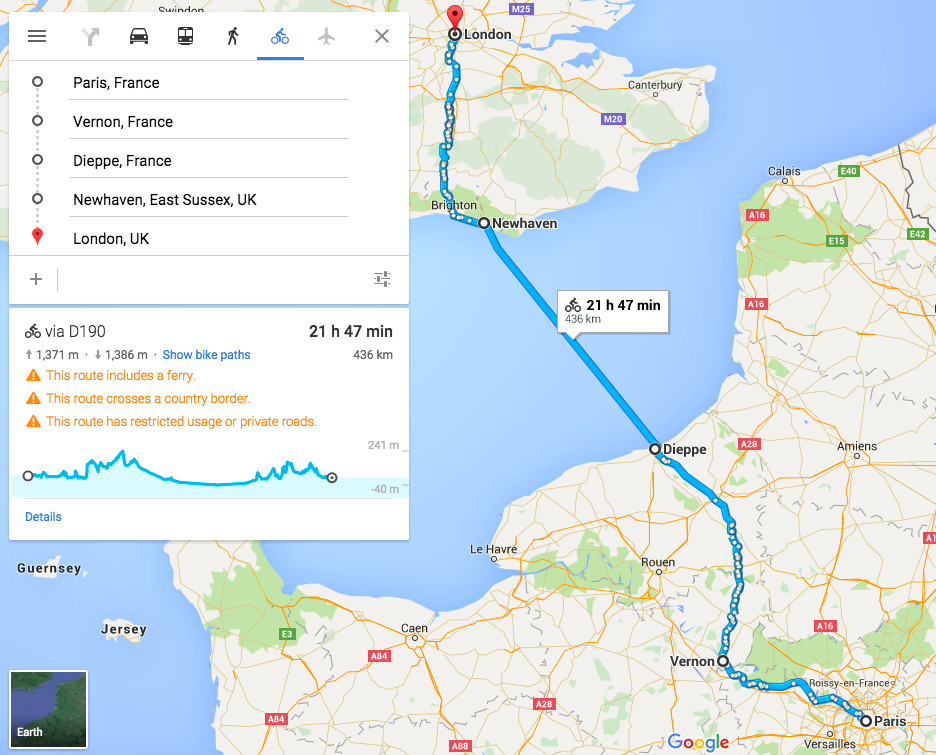

Tomorrow is the day to ride.

Anyone who has done a long-distance ride knows how difficult it is to organise the whole thing logistically. Thankfully, I am pleased to say that [Techbikers](http://techbikers.com/) (thank you [Marie](https://twitter.com/marmarlade)!) has covered all the details, they have everything planned — accommodation, food (the level of detail is unbelievable!), transport (of both people and bikes) and the other logistics. So, everything is under control as much as it can be: it is up to us to ride.

The Paris — London ride is split into three days: Friday, Saturday and Sunday. We meet tomorrow morning at St. Pancras station, take the Eurostar to Paris where we gather at the Eiffel Tower to collect the bikes and take a group photo. After that, [the fun begins](https://medium.com/@msrsan/techbikers-2015-paris-london-am-i-ready-e2b0c09fc14).

{:class="img-responsive"}

The route divided into days looks like this:

- Friday: Paris-Vernon => 90 km (route)

- Saturday: Vernon-Dieppe => 118 km (route)

- Sunday: Newhaven-London => 96 km (route)

On the other hand, the thing that we don’t have control over is the weather. Apparently, it’ll rain tomorrow and we’ll have a wet start in Paris, but it will clear up on Saturday and Sunday. One has to be careful on the slippery roads.

Fingers crossed! :)

--

I will be cycling from Paris to London with 70 likeminded individuals. Apart from the pain and thrill I’ll go through, I will be raising £500 for the RoomToRead. [Since everyone who read this had a chance for a good education](https://medium.com/@msrsan/techbikers-2015-paris-london-turning-the-tide-on-illiteracy-18474d7c979b), I would like to ask you to help me fundraise on the link below:

**[http://bit.ly/msrsan-for-RoomToRead](http://bit.ly/msrsan-for-RoomToRead)**

Thank you! :)

PS: There will be more updates over the next days, so make sure to follow my [Twitter](http://www.twitter.com/msrsan) and [Facebook account](http://www.facebook.com/msrsan). Thanks!

--

[Original post on Medium](https://medium.com/@msrsan/techbikers-2015-paris-london-tomorrow-fed1ace0cd9b)