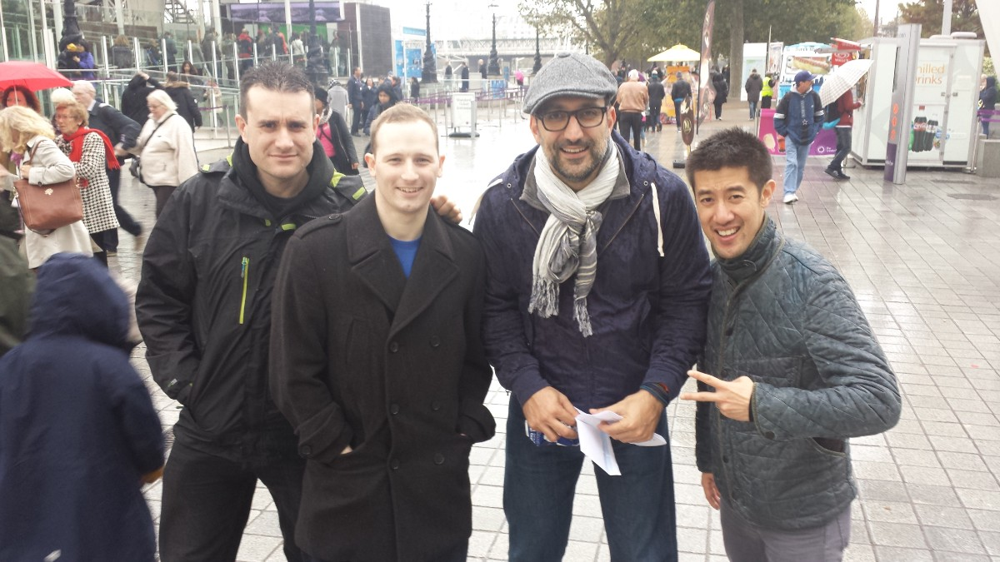
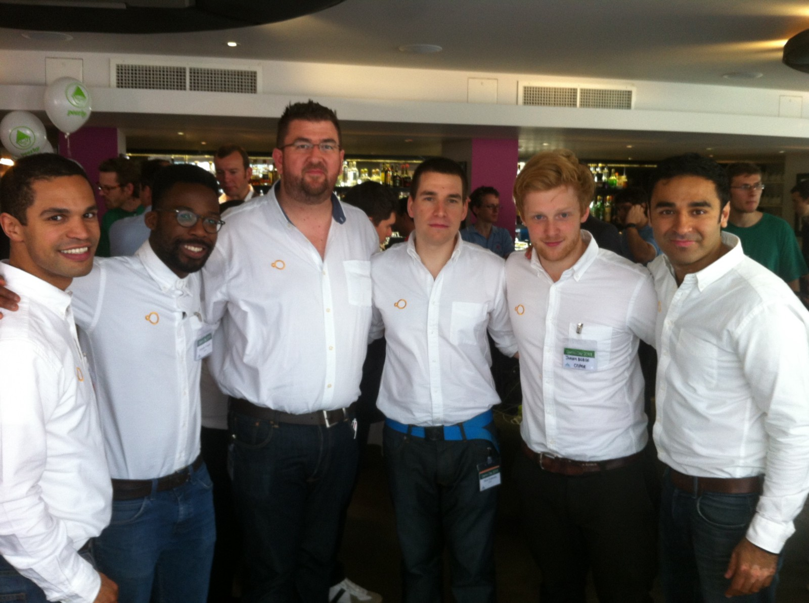
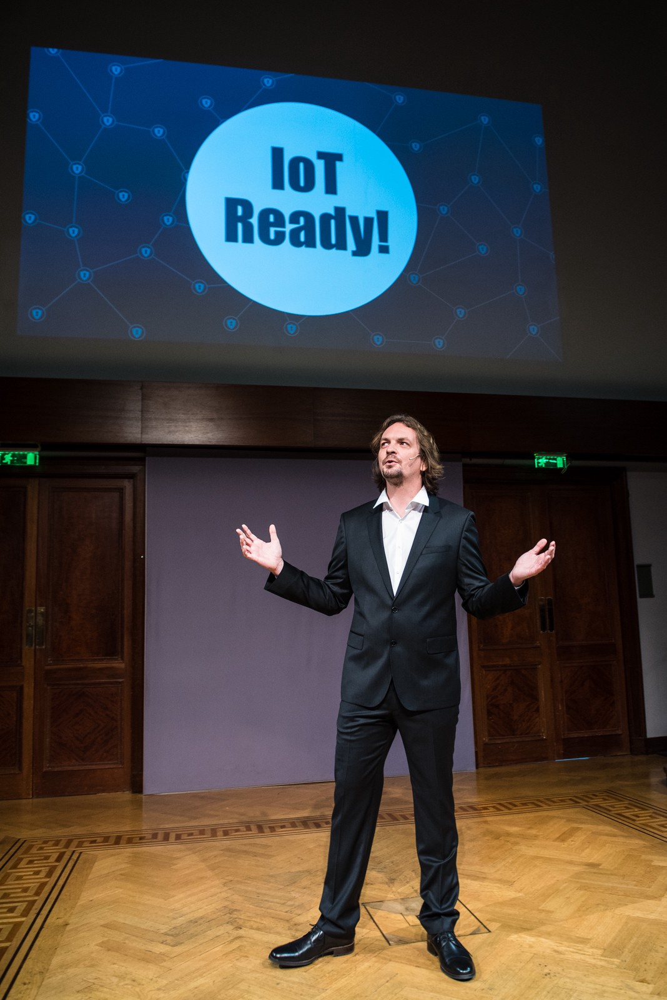

*Techstars London Fall 2015 Cohort*

As Techstars London heads towards its third birthday, we thought it would be useful to hear from some of the great alumni companies on how to crack the application process. So we sat down for a chat with [Osper](https://osper.com/) (a mobile youth money management application), [Lingvist](https://lingvist.io/) (an online platform for speedy language learning), [Geospock](http://www.geospock.com/) (geospatial database technology) and [TeskaLabs](https://www.teskalabs.com/) (security for mobile and IoT applications).

**Osper** (Nicolas Esteves): The main reason we applied was for mentorship — we wanted to get support and meet great people. On top of that, we wanted focus and the intensity of the program gave us that.

{:class="img-responsive"}
*Team Lingvist, just before the Techstars Program*

**Lingvist** (Mait Müntel): We were referred to Techstars from an ex-Skype guy.

**Geospock** (Dr. Steve Marsh): We needed more contacts in the industry and we wanted hands-on mentorship to help shape the business strategy.

**TeskaLabs** (Ales Teska): The Techstars brand is great and we eventually chose London as the best location. Apart from the good timing, the reason for Techstars London was strategic as we were targeting the UK market.

**Techstars London: What was the best / worst part of the application process?**

**Lingvist**: There were no worst parts. The application process itself was great, especially the final in-person interviews.

**Geospock**: It was hard to know what to expect a first. The group-interview part of the process was a bit nerve-racking but we received some very helpful feedback and obviously excited enough of the mentors for us to be given a place on the programme.

**TeskaLabs**: It was an interesting experience — during the process, we had a call with Techstars Boston and I remember we were at a conference in Germany. Obviously, it was quite challenging to find a quiet place with stable connection at midnight. We managed.

{:class="img-responsive"}
*Ben Taylor (Rainbird), Dr. Steve Marsh (Geospock), Sohrab Jahanbani (Bidvine) and Tak Lo (ex-Techstars) during a Treasure Hunt search on Day 1*

**Techstars London: Why do you think you got accepted?**

**Osper**: That’s a tough question. I feel we got accepted because of our mission of empowering kids to manage their finances — it is a targeted proposition that people easily understood.

**Lingvist**: I would say the biggest difference was made by a warm introduction from SmartCap, the investment arm of Estonian Development Fund.

**Geospock**: At the time we had a strong tech product and I think being from Cambridge University helped, even though we lacked commercial know-how.

**TeskaLabs**: It was a mix of everything: good timing, cybersecurity being a hot sector, domain knowledge and great people on the team.

**Techstars London: At what stage was your company when you applied for Techstars?**

**Osper**: At the time of the applications, we had a prototype and a dozen people signed up to try it. We knew what we had to do and how to build, but we were still early.

**Lingvist**: At the time, we had no product — just an idea on our slides.

{:class="img-responsive"}
*Team Osper after the Techstars Demo Day*

**Geospock**: When we applied, we had just raised our seed round and had our mobile tech stack developed. We needed to test if there was a market for it.

**TeskaLabs**: As part of StartupYard, we have been already “accelerated” and were raising a seed round in CEE with a product that was a few months old.

**Techstars London: What did Techstars help you most with?**

**Osper**: We had a plan and Techstars made us think more quickly and more aggressively. Meeting advisors and mentors helped with that process. Everyone in our team became an expert in their field and became more accountable — less bullshit, more real.

**Lingvist**: The biggest value we got out of Techstars was to learn how to pitch — it helped us pitch future employees, for sales purposes and of course, for raising money. It is definitely more important than I thought.

**Geospock**: We found our target audience and a way to help companies with our tech. The biggest help we got was with the commercial aspects of actually running a company.

**TeskaLabs**: Technologically, during Techstars the product didn’t change, but the business strategy shift was significant — selling know-how and business model iteration was something that we got considerable help with.

**Techstars London: What was the best part of the 3 month program?**

**Osper**: Just being a part of the cohort was the best part. We were able to talk to the other cofounders, exchange ideas, challenges and solutions. The synergy was awesome!

**Lingvist**: There were a lot good things during the program. One thing that stood out was the Mini MBA on how to conduct interviews. Also, as I mentioned before, the pitching exercises were intense, but really great and useful.

**Geospock**: The Demo Day after party was definitely a good part! I was high on adrenalin after the Demo Day pitching and I also ended up going straight to No.10 to pitch on the same day — so it was good to relax after a job well done. All in all the whole programme was great — meeting other founders and mentors and building the network was pretty special.

{:class="img-responsive"}
*Ales Teska (TeskaLabs) pitching during the Demo Day (image by Dan Taylor)*

**TeskaLabs**: The best part was actually after Demo Day — the realisation that our pitch was great with a huge amount of contact from interested parties.

**Techstars London: What was the post-Techstars life for your company? How is the company doing now?**

**Osper**: So, when Techstars finished we had 6 people on the team. In May 2014 we raised our Series A, had our product launch in July 2014 and have kept on building the product and getting users. At the moment, we have 30 people on the team with a 20% month-on-month growth. We kept in touch with the people from the industry and the cohort, the value didn’t stop — it’s a long term benefit to be part of the network.

**Lingvist**: Since we raised money on the first day of the program we had sufficient runway so post-Techstars life was mostly about building product, increasing retention and learning to be as efficient as possible.

**Geospock**: We spent five months fundraising after Techstars. It was a long process because of the highly technical nature of the product which needed to be explained and, more importantly, understood. Eventually, we closed the Series A of $5.4M, moved offices and have grown the team from 8 to 14. The story continues.

**TeskaLabs**: It’s busy — we are trying to keep the same pace as during the program. Most of the team have moved to London.

So that’s the inside story from some great founders. We’d like to thank Nico, Mait, Steve and Ales for their time!

--

If you think you’ve got what it takes to be part of Techstars, here’s the next step: [Techstars London Applications — All you need to know](http://www.techstars.com/content/blog/techstars-london-what-you-need-to-know/). And we have been building some great resources from across the startup ecosystem here: [European Startup Resource Page](https://medium.com/@dalynewspaper/european-startup-resource-page-1cffd6626edb#.pgbamadgr).

--
[Original post on Medium](https://medium.com/@msrsan/applying-to-techstars-london-the-inside-story-from-osper-lingvist-geospock-and-teskalabs-f7db229f1d91)