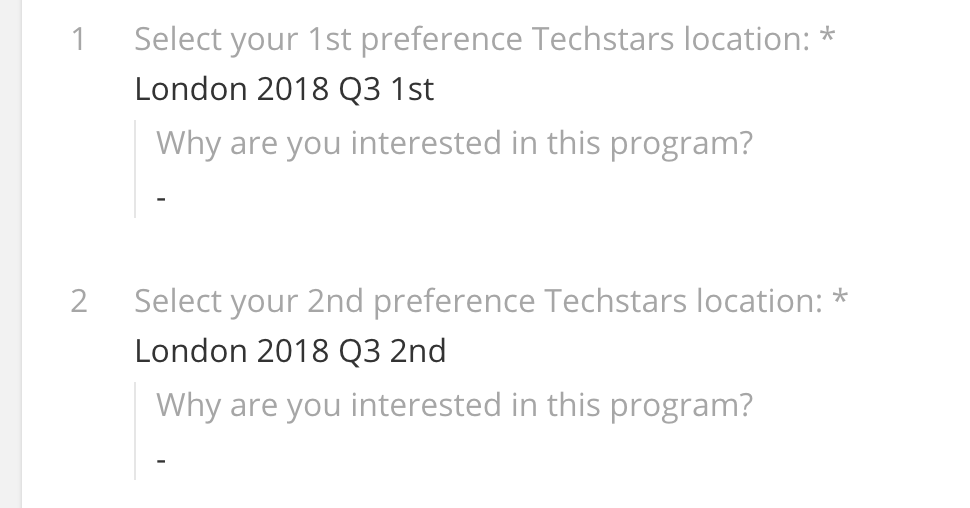

*FindMeCure (Techstars London 2017) application front page*

Applications for the [Techstars London 2018 program](https://www.techstars.com/programs/london-program/){:target="_blank"} close by the end of the day on Sunday, April 8th 2018. Historically, more than a thousand companies will apply and the competition to get one of the ten spots in the Summer class will be really competitive. See what some of our [alumni said about the applications.](http://msrsan.com/startup/Applying-To-Techstars-London-The-Inside-Story-Osper-Lingvist-Geospock-TeskaLabs.html){:target="_blank"}

As the whole selection process is lengthy (selected companies will have 8-12 interviews in total), the primary reason why you'd want your application to stand out is to get to the interview stage; to be picked out from the broader pool of candidates, to intrigue and provoke interest and make the selection team say **"Yes! I wanna talk to this company and find out more about what they are building!".**

We spoke to ~400 companies in the previous few months, both in person and over a call, some asked for help with their application and for tips, some didn't, but in order to make sure your application stands out and gets noticed in a sea of them, here are a few tips. 

1. Focus on your strengths 

    When you think about it, applications are extremely short, there are a couple of questions that you provide answers to, you provide your personal and professional details, submit a team and product video and that's it. The space and time for us to go through it is minimal and limited (do keep the videos up to 1 minute length please). 
    
    Therefore, in order to stand out, you need to focus on your strenghts: what are you and your team exceptional at, what makes you unique to solve a problem that you identified, what is your competitive advantage over anyone else doing this (there's bound to be competition). 
    
    In a limited space and time, adding anything that is not a clear strenght, but potentially neutral might be seen as a weakness. You always wanna play on your strengths. 
    
2. Provide details on the founders and include the team and product videos

    Techstars criteria are simple: team, team, team, market, traction, idea. Clearly, we focus on the founding team and the people running the company. Therefore, definitely provide insight into the founding team and include the team video with it. Tell us your story, make it personal, show us how you met your cofounder, how you plan on building your team, what is your background and domain experience. Show off by providing the product video, show us how bling bling it is and how the UX is awesome. Amaze us.
    
    By not providing the team video, you are missing out on the opportunity to show your *human* side - to show us how you interact within the team, to talk to us without talking to us. Do not miss that opportunity!
    
    I know companies apply for various programs, grants, incubators and accelerators, some use videos for VCs as well as teasers. One of the wrong ways to do it is to use a wrong name in the application video - to have *"application for X"* (from a few months ago) when you are actually applying for Y (now). Pay attention to details; we will.
    
    {:class="img-responsive"}
    *Tenzo (Techstars London 2016) Founder Video*
    
3. We actually read the answers
    
    Believe it or not, we will read through all the applications and will watch all the videos. By answering the questions in a non-robotic way, the higher the chance is that the emotional response will form. 
    
    Eventually, we will invest in people and not robots and, like it or not, we will be connected on an emotional level with the founders (as well as on the professional level). We want to understand your pain and get excited about your company!
    
4. Do your homework 

    During the selection, we will do a lot of due diligence about you, your previous work experience, we'll reach out to your colleagues and our network to actually find out how tenacious and persistent are you, how you receive feedback and how you work with people. 
    
    In the same way, you should do your homework and research about us, make sure you know our mentors, our investors and our network. Tell us why you are applying to a certain program, because of a certain mentor, a certain background of that MD or because all your potential clients are there. Tell us how can we help you exactly. 
    
    {:class="img-responsive"}
    *Choosing the right location is important*

5. Put in the work and don't lie
    
    Actually think about the application and the answers, don't do it on the fly. A sloppy application stands out the same way a thoughtful one does and it will show your dedication and attention to detail. Application is one of the first steps to make a good impression about yourself and one of the first indicators about how you'll be running your business for the next 5, 7, 10 years. It does tell a lot about you.
    
    Also, do not lie. No traction is better than a madeup traction. Noone hired is better than a highly respected made up VIP employee. Clearly admiting there are things you do not know the answers to is better than bull*hiting and making stuff up. The network is highly accessible and words travel fast. Don't lie.

There are **4 days** to go until Techstars London 2018 applications close. If you still haven't, apply [here](https://apply.techstars.com){:target="_blank"}. When you do, in order to stand out, you can email me and let me know.

--

Thanks to [Eamonn](https://www.twitter.com/eamonncarey){:target="_blank"} for proofreading and contributing and [Jess](https://www.twitter.com/jessinblue){:target="_blank"} for the initial thoughts.

Sources that helped put this blog post together:
- [Google Search](https://www.google.co.uk/search?q=Tips+and+tricks+on+how+to+apply+to+Techstars&ei=KgLFWonYMMWXsAG69rjQAg&start=0&sa=N&biw=1680&bih=882){:target="_blank"}
- [Tips from MDs](https://www.techstars.com/content/entrepreneur-resources/applying-techstars-tips-managing-directors/){:target="_blank"}
- [12 Things to consider](https://www.techstars.com/content/accelerators/12-things-consider-techstars-application/){:target="_blank"}
- [7 tips for applying](https://blog.digitalocean.com/7-tips-for-applying-to-techstars/){:target="_blank"}
- [Why you should apply for Techstars](https://www.geekwire.com/2013/apply-techstars-tips/){:target="_blank"}
- [7 ways to make your application stand out](https://www.entrepreneur.com/article/246303){:target="_blank"}
- [How to get into Techstars - interview with Jon Bradford](https://startupxplore.com/en/blog/how-to-get-into-techstars-and-more-interview-jon-bradford/){:target="_blank"}
- [How to get into Techstars - Q&A](https://www.codementor.io/startups/tutorial/applying-to-techstars-how-to-get-in){:target="_blank"}
- [Guide for getting into Techstars](http://www.businessinsider.com/techstars-application-2011-11?IR=T){:target="_blank"}