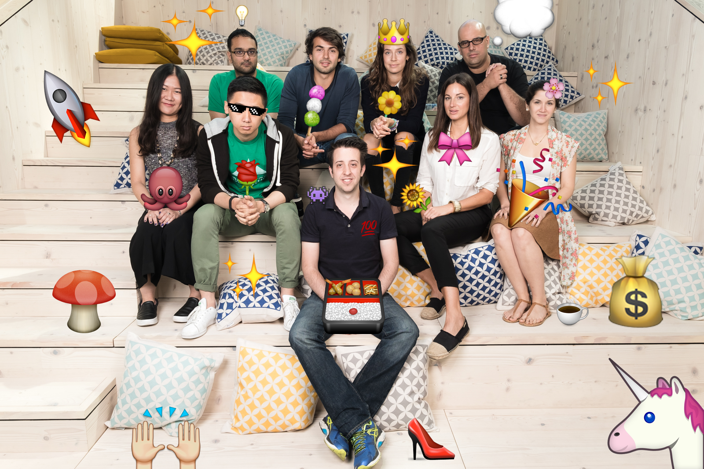

*Techstars London 2017 associates*

**Who are the associates?** 

Associates are people that come in during the Techstars Program and then work closely with the companies Techstars selected. As we want our companies to accelerate as fast as possible, Techstars hires associates to give that extra fuel. Associates would come from all kinds of backgrounds and would mostly fall under: Business Development, Marketing, Software Development and Design.

{:class="img-responsive"}

*Techstars London 2016 associates*

Associates will help build the next amazing batch of startups, as they grow from early stage to venture-backed companies. It’s basically a chance to hack the system and go through the program as Founders do, to get amazing experience, get real stuff done and broaden your network in ways you could never imagine, get exposure to some of the greatest up and coming companies and teams in Europe. 

Historically, most associates end up being employed by one of the teams or by someone they met during the span of the three months. Some go on to join other companies in our network, go on into the VC space or join even Techstars fulltime. Many also go on to build their own companies.

{:class="img-responsive"}

*Techstars London 2015 associates*

The next Techstars London program starts on July 16th and ends mid October and we will have 1 or 2 Business Development, 1 or 2 Marketing, 2 Software Development and 2 Design associates. On top of that, we will also hire an [Operations Associate](https://www.techstars.com/jobs/8a78839e62f0c81f0162f6ed92615244/?gnk=job&gni=8a78839e62f0c81f0162f6ed92615244) who will be working closely with Eamonn (MD) and me in order to help us run and operate the program efficiently and smoothly. If you are interested in the Ops Associate role, do reach out directly!

There are a lot of blogposts out there about the role and about other associates' experiences online, here are the ones that stand out:

1. Jay Kapoor - [My Summer as a Techstars NYC Associate](https://jaykapoor.com/my-summer-as-a-techstars-nyc-associate-e4ba258339c4){:target="_blank"}

2. Dirk Lehmann – [Techstars Associate Programme: The Better Startup MBA?](https://medium.com/@DirkLehmann/techstars-associate-program-the-better-startup-mba-897d8070a313){:target="_blank"}

3. Kelly McDonald – [Learn More Faster](https://www.techstars.com/content/blog/learn-more-faster-a-techstars-associates-journey/){:target="_blank"}

4. Anthony Marnell – [Techstars New York: A Reflection](http://vacationanthony.com/post/56144631855/techstars-new-york-a-reflection){:target="_blank"}

5. Duc Luan Dam - [Luan, do you ever sleep?](https://medium.com/@luandd/luan-do-you-ever-sleep-being-an-associate-at-techstars-part-1-d54e64fc80b0){:target="_blank"}

I also wrote two blog posts about my experience: [How I got accepted into Techstars London](http://msrsan.com/startup/How-I-Got-Accepted-To-Techstars-London.html){:target="_blank"} and [Lessons Learned](http://msrsan.com/startup/Lessons-Learned-From-The-Techstars-London-Winter-2014-Batch.html){:target="_blank"}.



So, if you are interested, do apply here or spread the word:
1. [Business Development Associate](https://www.techstars.com/jobs/8a78839e62f0c81f0162f6e4c00051af/?gnk=job&gni=8a78839e62f0c81f0162f6e4c00051af){:target="_blank"}

2. [Marketing Associate](https://www.techstars.com/jobs/8a78839e62f0c81f0162f6e88773522f/?gnk=job&gni=8a78839e62f0c81f0162f6e88773522f){:target="_blank"}

3. [Software Development Associate](https://www.techstars.com/jobs/8a78839f62b28d080162b551a7ef02f7/?gnk=job&gni=8a78839f62b28d080162b551a7ef02f7){:target="_blank"}

4. [Design Associate](https://www.techstars.com/jobs/8a78839f62b28d080162b5634dc13d8e/?gnk=job&gni=8a78839f62b28d080162b5634dc13d8e){:target="_blank"}

If you still have question, do reach out - happy to jump on a call and clarify!