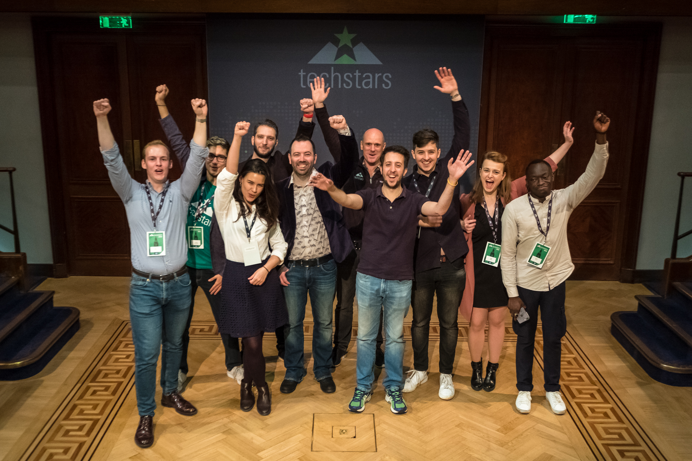

*Techstars London 2018 cohort*

This summer [Techstars London](https://www.techstars.com/programs/london-program/){:target="_blank"} ran its 7th program and, as it has been said all around, it was a smorgasbord of companies – from machine learning and computer vision to foodtech and fish, and from VR games to knowledge management.

For me, this was the 5th Techstars program I was involved with and it was by no means less exciting than the previous ones.

1. (Another) Transition

    After Springboard got acquired by Techstars in 2013, Techstars London became the [first international](https://www.techstars.com/content/blog/announcing-techstars-in-london/) Techstars program and it was run by Jon Bradford. Jon was also the MD when I joined in 2014 as an associate. In 2015 Jon transitioned out and Max Kelly joined us as an MD. Max and I ran 3 programs (2015, 16, 17) together. After the 2017 program, Max transitioned out to a VP of Innovation and Strategy role within Techstars and [Eamonn Carey](https://www.techstars.com/content/accelerators/announcing-eamonn-carey-managing-director-techstars-london/) jumped in. 

    Transitions are always interesting and fun for two reasons: 1) making sure the **transition is smooth** and; 2) a **new person** joins the team.

    US Presidents have a [~3 month transition period](https://en.wikipedia.org/wiki/United_States_presidential_transition) where the administrations go through a formal planning and cooperation mechanisms. In a fast paced startup world we currently live in, with dozens (or hundreds) of stakeholders that are pulling a person aside and where there is no time, transitions can be tricky. They can be done properly through discipline and a proper handover process. From introductions to some (all?) stakeholders, sharing contacts and network, going through the know how and best practices to make sure the **quality stays as high** and lessons learned weren't in vain to the administratial, bureaucratic handover. On top of that, it allows for planning and next steps.

    When a new person joins the team, she brings everything with her - personality and charm, management skills and experience (working with big, working with small companies and teams), communication and work style and domain expertise. It is a **new person** coming on board. 

    I knew [Eamonn](https://www.linkedin.com/in/ecarey/) from before, he was a mentor since the beginning of Techstars London, he was an EIR with the Barclays program, we cought up a number of times and even had a beer or two in Dublin once, but I haven't worked with him before. It was super fun to go through another transition, to see and observe what he thinks about startups and challenges they have, what is important to him when evaluating and working with them, how he approaches changing people's lives. It is **humbling** to get another chance to learn from an MD, be flexible and adapt to a slightly different management style, get and accept new angles, but still move fast as ever and be succesful at it.

2. The most multicultural cohort so far

    It was my 5th cohort and I believe it was the most multicultural cohort so far. Perhaps we did not have as many nationalities as before (we had ~19 if I remember right, but in 2016 we had 22 nationalities out of 42 people), but this year's cohort reach was broad. From South Korea and Hong Kong to India in Asia to Ukraine, Finland, Portugal and Estonia in Europe, to a company from the US and a few from the UK. **It was a trully global program.**

    And it could be felt in the office as well - and I am not even talking about the Bollywood dancing night. **Different backgrounds and styles**, some quiet and calm, some loud and all over the place, some with a "just do it, I'll ask for help later" and some with "I will make sure I know everything and then do it" approach. People that started "Google" in Korea, people that sang opera as kids and acted in theatre, people that traveled the world, built games, saved their trading floors from crashing, built and sold companies before, launched major labels in the US ... but genuinely nice and kind people!
    
    
    
    Without such a diversity in thoughts, experiences and approaches, it wouldn't be the same.

3. Associates make Demo Day work!

    As the program came to a close with 15 days to go until Demo Day, the **Associate team got more aligned towards a common goal** and worked closer together, closer than it ever had before during the last 75 days. Picking up stuff from the print shop, taking CEOs for walks (to rehearse their pitch, not just for random walks - that would be weird), getting the volunteers to help out on the day, helping Eamonn and me with the Investor Lunch and working closely with the companies on their company decks. With the deadline fast approaching and pressure mounting, **it never fails to show how individuals become a team.**
    
    And that was most apparent in the final days when our **MK Consultancy** ([Mason](https://www.linkedin.com/in/masonelhage/) and [Kwame](https://www.linkedin.com/in/kwame-afriyie-90317486/), our Design Associates), worked 30h days across 10 companies with different ideas and expectations, each pulling on their end and got their Demo Day decks polished and up to a level where they needed to be. I was just happy to coordinate and help them bring out the best in them.
    
    With their passion, hands on work, determination and belief that their work can make a difference for our companies, they did indeed - [Demo Day](https://www.youtube.com/watch?v=lb75qfrvDiA&feature=youtu.be) was amazing!
    
{:class="img-responsive"}

*Techstars London 2018 CEOs*

{:class="img-responsive"}

*Techstars London 2018 Team*

You can read some of the Program and Demo Day coverage in [Forbes's piece](https://www.forbes.com/sites/maikoschaffrath/2018/10/10/3-startups-show-the-rise-of-tech-for-good-at-techstars-london-demoday/#6031b6cc5bb9), [Cynthia's comment](https://www.linkedin.com/pulse/impressive-impactful-cohort-cynthia-nadal/), [Overview of Pesky Fish in Forbes](https://www.forbes.com/sites/johnwelsheurope/2018/10/04/how-pesky-fish-is-reinventing-the-supply-chain-to-deliver-seafood-fresh-to-chefs/), [Steve's blog post](https://medium.com/@steventjenkins/7-tips-to-making-the-most-of-a-startup-accelerator-f49dcf053f4c) and a bunch of other across the Internet.
    
--

All in all, it was a great program! If you wish to contact the companies, do it [here](http://demoday.techstars.com/london-2018-q3). However, if you are building a company and want to be a part of *Techstars London 2019*, do please [get in touch](mailto: marko.srsan@techstars.com). 