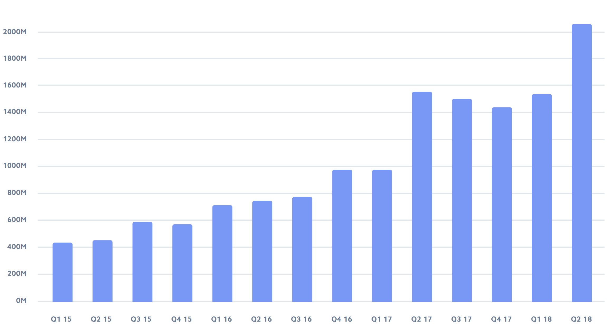
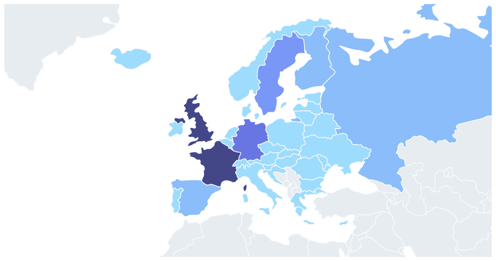
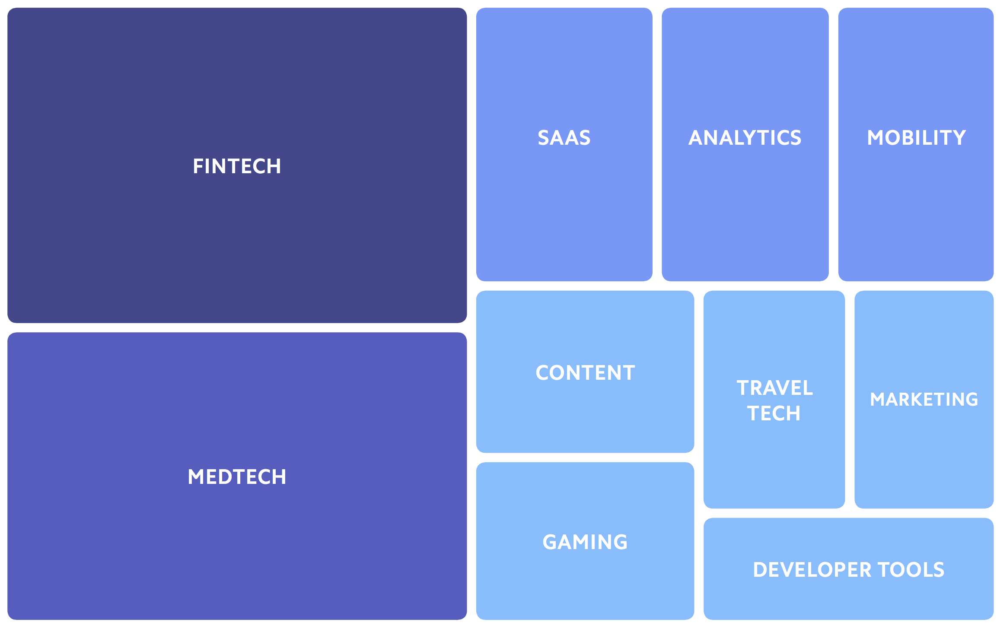

On stage of the Web Summit, one of the biggest startup conferences in the world, [Eamonn Carey](https://www.linkedin.com/in/ecarey/) shared the results of the **“Seed the Future: A Deep Dive into Early Stage Technology in Europe”** report created by Stripe, Tech.eu and Techstars.



The report's aim is to better understand the state of technology, startups and investments in Europe in the Early Stage Technology (EST) segment and reached a number of conclusions. If you want to see the **full report**, please find it on the [Tech.eu site](http://tech.eu/seedthefuture).

1. Investment in European Early Stage companies is at all time high

    [{:class="img-responsive"}](http://tech.eu/seedthefuture)
    
    European technology has been going from strength to strength with total capital invested into European tech at €19bn in 2017, a 36% increase from €14.3bn in 2016. And the investment in EST has increased four-fold in the period from H1 2015, going from €875 million invested in the first six months of 2015 to more than **€3.6 billion in H1 of 2018.** 
    
2. France and the UK are the strongest when it comes to Early Stage investment

    [{:class="img-responsive"}](http://tech.eu/seedthefuture)
    
    France and the UK are neck and neck when it comes to EST investment. The research shows that France generated almost a quarter (24.04%) of the deals in Europe, just shy of the UK’s 24.59%. This highlights **the growth of France’s startup scene** over the past five years. 
    
    In comparison to the rest of Europe, UK and France have significantly more investment in EST companies than other European countries like Spain (3.9%), Italy (1.92%), Portugal (0.26%)... 
    
3. Fintech and medtech lead

    [{:class="img-responsive"}](http://tech.eu/seedthefuture)

    The report found that **Fintech** startups such as Monzo and N26, and **Medtech** startups such as Dr.Focused, Kry and Doctolib have benefited most from the influx of investment. Consequently, they have each received €2.32bn and €2.07bn in investment respectively over the last three years.

These are indeed the exciting times for the European Startups and Investment Community!

To dig into the full details, download the [**Full Report**](http://tech.eu/seedthefuture).