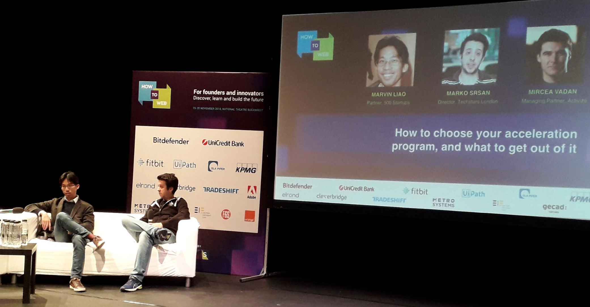
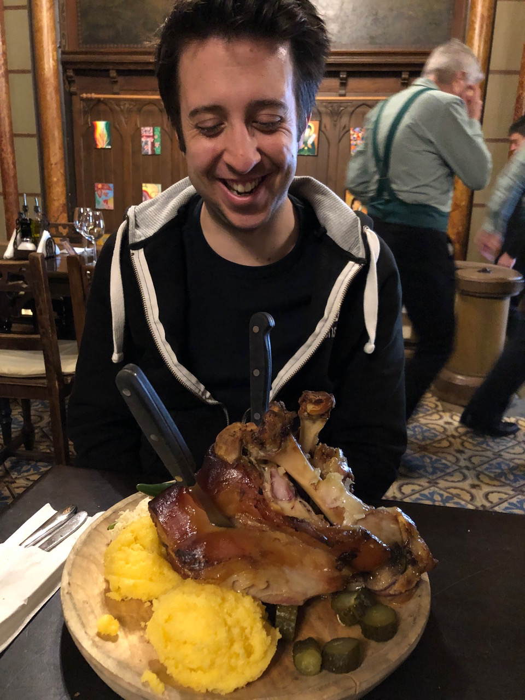

It is safe to say that without [Bogdan Iordache](https://www.linkedin.com/in/bogdaniordache/), the Eastern European startup scene would not be as connected and as integrated as it is. [How To Web](https://www.howtoweb.co/), a conference he started back in the day, is a **real example** of that as it brings dozens of Western entrepreneurs and investors that fly in from all over the world and mixes them with the local and regional counterparts. 

{:class="img-responsive"}

*Marvin Liao from 500 Startups and myself sharing more about what accelerator do and how can we help. Photo by [Larisa](linkedin.com/in/larisa-ramona-spanoche-736089142)*

As often seen in the rest of the region, the local companies are always **exceptionally technically strong** - no one has a challenge in building their products, adding new features and pushing it out. The technical capabilities are super high. After a few local exits (Clever Taxi, Vector Watch ...) and having its first unicorn in [UI Path](https://www.uipath.com/), the Romanian startup scene is **strong** and its future is really exciting. 

On the other side, *things* to improve are commercial and business capabilies, closeness to the market and potential customers and pure know-how of selling. And it will be interesting to observe over the next 2,3 years as the early UI Path employees start new companies and combine their tech masterskills with massive sales knowledge, experience and network gained. 

--

Even though I've known Bogdan since 2013, this was my first time in Bucharest and I had a great time catching up with good friends and colleagues and meeting a lot of new ones - thank you for having me!

--

{:class="img-responsive"}

*Dominate the niches. They can be big. Marvin Liao from 500 Startups*

{:class="img-responsive"}

*Jon Bradford sharing insights about how corporates and startups play.*

{:class="img-responsive"}

*It is safe to say I had some good food at [Caru' cu Bere](https://foursquare.com/v/caru-cu-bere/4b66b091f964a52090272be3).*
